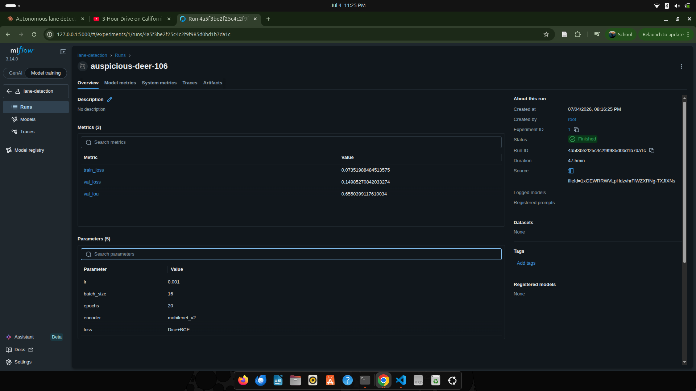
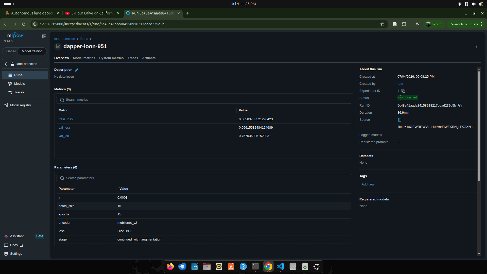

# Autonomous Lane Detection

Semantic segmentation-based lane detection using U-Net with a MobileNetV2 encoder, trained on the TuSimple dataset, with polynomial curve fitting for lane geometry and vehicle offset estimation.

**🔗 Live Demo = https://autonomous-lane-detection-5krviztudrkbodbwelpj9i.streamlit.app/

## Demo


U-Net decoder with a MobileNetV2 encoder pretrained on ImageNet, fine-tuned on TuSimple for binary lane segmentation (6.6M parameters).

## Results

| Stage | Val IoU | Notes |
|---|---|---|
| Baseline (no augmentation, 20 epochs) | 0.665 | lr=0.001 |
| Continued with augmentation (+15 epochs) | 0.757 | lr=0.0003, resumed from baseline checkpoint |
| **Test set (TuSimple test split)** | **0.519** | Ground-truth masks reconstructed from JSON lane coordinates (10px line width); not directly comparable to validation IoU due to differing mask rendering style |

Data augmentation (random horizontal flip, brightness/contrast jitter) improved validation IoU by ~9 points and reduced overfitting, as shown by validation loss stabilizing instead of climbing in later epochs.

## Experiment Tracking

Training was tracked with MLflow across two runs.

**Baseline run** (no augmentation):


## Experiment Tracking

Training was tracked with MLflow across two runs.

**Baseline run** (no augmentation):


**Continued run** (with augmentation):


## Pipeline

1. Image -> trained U-Net -> binary segmentation mask
2. Mask -> connected components -> separate lane blobs
3. Polynomial curve fitting per lane (constrained to detected pixel range to avoid extrapolation artifacts)
4. Vehicle lane-offset estimation

## Setup

```bash
git clone https://github.com/jibachyadav/autonomous-lane-detection.git
cd autonomous-lane-detection
conda create -n lanedetect python=3.10 -y
conda activate lanedetect
pip install -r requirements.txt
```

## Usage

```bash
python src/inference/predict.py       # run on sample images
python src/inference/video_infer.py   # run on video
streamlit run src/app.py              # run the interactive dashboard locally
```

To view experiment tracking locally:
```bash
mlflow ui --backend-store-uri sqlite:///mlflow.db

Project Structure
autonomous-lane-detection/
├── src/
│   ├── data/            # dataset loading + augmentation
│   ├── models/          # model architecture
│   ├── training/        # loss, metrics, training loop
│   ├── inference/       # image + video inference, post-processing
│   ├── evaluation/      # ground-truth generation, test-set scoring
│   └── app.py           # Streamlit dashboard
├── models/              # trained checkpoint (best_model_v2_safe.pth)
├── outputs/             # demo results, screenshots
├── mlflow.db            # experiment tracking database
└── requirements.txt

## Notes

The video demo above uses out-of-domain footage (not TuSimple) to demonstrate generalization — the reported validation IoU (0.757) is measured on the TuSimple validation split specifically, not on this demo clip. Test-set IoU (0.519) uses ground-truth masks reconstructed from raw lane coordinates rather than TuSimple's pre-rendered masks, which affects direct comparability with the validation number due to differences in mask line thickness/rendering.
